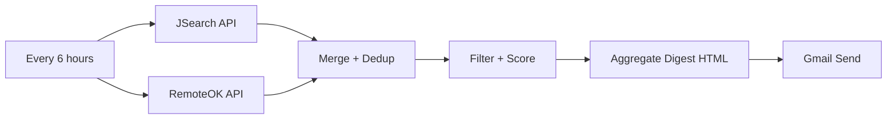

# n8n Automated Job Search Digest

Automates multi-source job discovery and sends a scored email digest every 6 hours using **n8n**. The workflow fetches jobs from **JSearch (RapidAPI)** and **RemoteOK**, merges & de-duplicates results, **filters + scores** roles against your skills, then **emails a digest** via Gmail.

> ⚡️ This is a transferable automation pattern you can adapt for lead gen, competitor monitoring, or compliance checks.

---

## ✨ Features
- **Multi-source fetch:** JSearch (RapidAPI) + RemoteOK.
- **De-duplication:** Based on URL/title/company.
- **Filter + Score:** Keyword match against configurable skill set → 0–10 score.
- **Email Digest:** HTML summary to your inbox on a schedule (default: every 6 hours).
- **Portable Design:** Swap sources or templates with minimal changes.

---

## 🧩 Architecture

*(Add a screenshot in `docs/img/workflow.png` and link to it here.)*

---

## 🚀 Quick Start

### 1) Prerequisites
- **n8n** (Cloud or self‑hosted; v1+ recommended)
- **RapidAPI key** for JSearch
- **Gmail** (OAuth or SMTP; n8n credential)
- Optional: **Docker** for running n8n locally

### 2) Import the workflow
1. In n8n, click **Workflows → Import from File**.
2. Select `workflow/job_digest_workflow.json` (export yours from your n8n editor: **Workflow menu → Export**).

> This repo includes the structure and sample code snippets; export your own JSON so you don’t commit secrets.

### 3) Configure credentials
- **JSearch (HTTP Request node):**
  - Method: `GET`
  - URL: `https://jsearch.p.rapidapi.com/search`
  - Headers:
    - `x-rapidapi-key: {{ RAPIDAPI_KEY }}`
    - `x-rapidapi-host: jsearch.p.rapidapi.com`
- **RemoteOK (HTTP Request node):**
  - Method: `GET`
  - URL: `https://remoteok.io/api`
- **Gmail (Gmail node):**
  - From: `{{ GMAIL_FROM }}`
  - To: `{{ RECIPIENT_EMAIL }}`

> Store secrets in n8n’s **Credentials**. Do not commit real keys to Git.

### 4) Set schedule
- Add a **Cron** node → Every **6 hours** (or use env var `DIGEST_EVERY_HOURS`).

### 5) Customize scoring & filters
In your **Filter + Score** Function node, paste/adapt the code in `workflow/scoring.js`.

### 6) Aggregate HTML email
In your **Aggregate Digest** Function node, paste/adapt the code in `workflow/email_template.js`.

### 7) Test & activate
- Click **Execute workflow** to test.
- Review the email; tweak skills/filters.
- Toggle **Active** to schedule.

---

## 🛠 Project Structure

```
.
├─ README.md
├─ LICENSE
├─ .gitignore
├─ .env.example
├─ workflow/
│  ├─ job_digest_workflow.json   # export yours from n8n (no secrets)
│  ├─ scoring.js                 # code snippet for scoring node
│  └─ email_template.js          # code snippet for email digest node
└─ docs/
   └─ img/
      └─ workflow.png            # optional screenshot
```

---

## 🔐 Security Notes
- Keep real secrets in **n8n Credentials** or `.env` used by Docker; never commit them.
- The included `.gitignore` already ignores `.env`, `.n8n/`, etc.

---

## 📈 Resume/Portfolio Angle
*Built an n8n automation that fetches, merges, scores, and emails job leads every 6 hours; reduced manual search time ~80% and demonstrated portable automation skills (APIs, scoring, HTML email).*

---

## 📝 License
MIT — see `LICENSE`.
